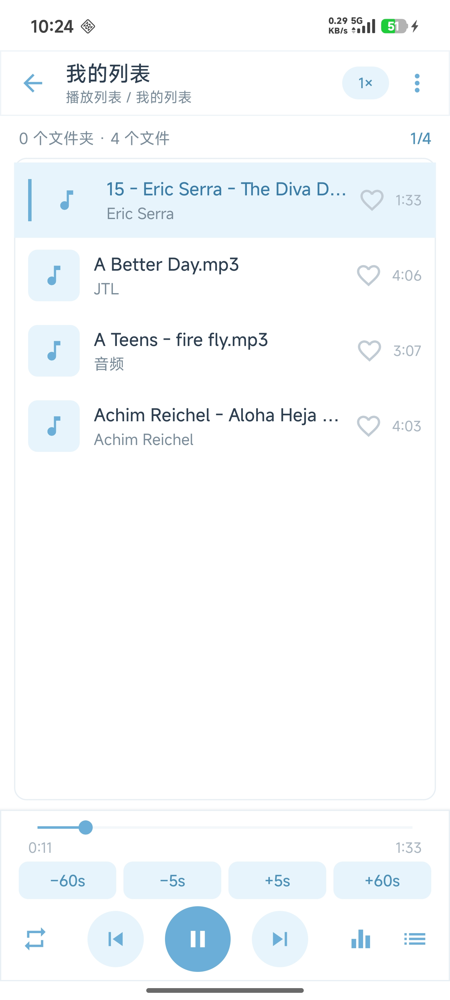
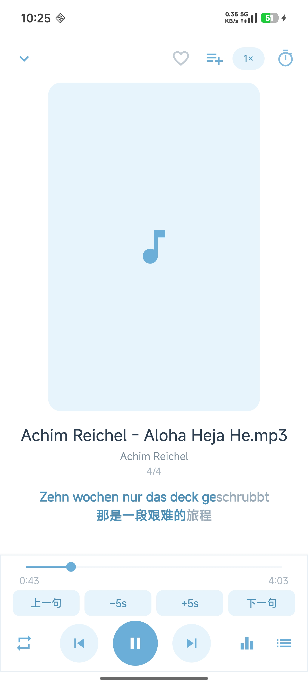
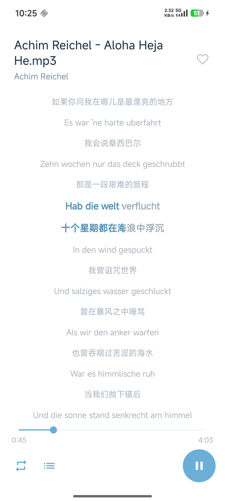

# 音乐播放器

本机媒体文件夹浏览与后台播放的 Android 应用。

[English](README.md)

## 截图

| 1 屏 · 浏览 / 播放列表 | 2 屏 · 播放 | 3 屏 · 歌词 |
|:---:|:---:|:---:|
|  |  |  |

- **1 屏**：文件夹 / 播放列表浏览，当前曲高亮，底栏控制  
- **2 屏**：封面、进度、收藏与加入列表、倍速 / 定时、迷你歌词  
- **3 屏**：全屏歌词（中外文对照）、跟唱高亮  

更多截图见 [`screenshots/`](screenshots/)。

## 简介

| 项 | 说明 | 
|----|------|
| 应用名 | 音乐播放器 |
| 语言 | Kotlin |
| minSdk | 24（Android 7.0+） |
| targetSdk / compileSdk | 34 |
| 构建 | Gradle 8.4 + AGP 8.3.2 |
| JDK | 17（可在本机 `gradle.properties` 配置 `org.gradle.java.home`，真实路径勿提交） |
| 路径 | 目录名含中文时需 `android.overridePathCheck=true`（已配置） |

## 主要功能

| 模块 | 说明 |
|------|------|
| 三屏滑动 | 文件夹浏览 / 播放器 / 歌词 |
| 媒体扫描 | MediaStore 音频 + 视频（仅播声音） |
| 主目录 | 可配置根目录入口（系统选目录） |
| 播放列表 | 用户自建列表；加入 / 移出 / 拖动排序；列表数据本地持久化 |
| 多选操作 | 1 屏长按多选：批量加入列表、批量删除文件；列表内批量移出 |
| 播放模式 | 单曲 / 文件夹循环 / 下一文件夹 / 随机 |
| 进度记忆 | 全局上次曲目；按文件夹记忆；启动定位；1 屏切歌时自动定位文件夹与文件 |
| 歌词 | 同目录同名 `.lrc`，卡拉 OK 进度、滚动跳转 |
| 定时关闭 / 倍速 | 支持 |
| 收藏 | 列表与播放页红心 |
| 均衡器 | 默认关闭，底栏按钮 |
| 锁屏控制 | MediaSession |
| 多语言 | 中文 / English / 跟随系统 |
| 主题 | 白底淡色多皮肤 |
| 文件操作 | 多选批量删除（系统确认）；加入播放列表 |

### 播放列表用法（简要）

1. **1 屏根目录** → 顶部「播放列表」入口；菜单可新建列表  
2. **长按文件**进入多选 →「加入列表」到已有列表或「新播放列表」；或批量删除文件  
3. **进入某个播放列表**后长按多选 →「移出列表」；多选后可用行尾手柄**拖动排序**  
4. **2 屏右上**「加入列表」图标 → 下拉选择目标列表或新建  

播放列表仅保存引用与顺序，删除列表不会删除设备上的媒体文件。

### 播放说明

- 扫描本机音频/视频（MediaStore），点击曲目播放  
- 底栏：上一首 / 播放暂停 / 下一首、进度、循环模式、均衡器、当前队列  
- 前台服务 + 通知栏 / 锁屏媒体控制  
- 权限：  
  - Android 13+：`READ_MEDIA_AUDIO`、`READ_MEDIA_VIDEO`、`POST_NOTIFICATIONS`  
  - 更低版本：`READ_EXTERNAL_STORAGE`  
- 首次启动需在系统弹窗中授予媒体（及通知）权限  

## 快速开始

### 本机配置（勿提交密钥与本机路径）

1. 创建 `local.properties`（已在 `.gitignore` 中忽略）：

```properties
sdk.dir=你的/Android/Sdk路径
```

2. JDK 17：设置 `JAVA_HOME` / PATH，或在**本机** `gradle.properties` 中设置 `org.gradle.java.home`（勿提交真实路径）。  
3. `adb` 在 PATH 中（或使用 SDK `platform-tools`）。真机开启 USB 调试。

```powershell
java -version
adb devices
```

### Android Studio

本仓库为标准 Android Gradle 工程（AGP 8.3.2、Gradle 8.4、Kotlin），**可用 Android Studio 直接打开、同步、编译与运行**。`build.js` / `gradlew` 只是命令行辅助，与 AS 使用同一套工程。

1. **File → Open** 打开工程根目录（含 `settings.gradle.kts` 的目录，不要只打开 `app/`）。
2. 等待 **Gradle Sync** 完成。
3. 选择 debug 变体 → **Run** 到真机/模拟器，或使用 **Build → Make Project** / **Build APK(s)**。

说明：

| 项 | 说明 |
|----|------|
| Android Studio 版本 | 建议 **Hedgehog / Iguana 及以后**（支持 AGP 8.3） |
| Gradle JDK | **Settings → Build → Gradle → Gradle JDK** 选择 **JDK 17** |
| `org.gradle.java.home` | 若本机 `gradle.properties` 里配置了该项，会覆盖 IDE 的 JDK；路径错误会导致 Sync 失败，可改正或删掉 |
| `local.properties` | AS 首次打开时一般会自动写入 `sdk.dir` |
| 中文路径 | 已配置 `android.overridePathCheck=true`；若仍异常，可尝试放到纯英文路径 |
| 签名 | 配置 `keystore.properties` + `release.keystore` 后，debug/release 可共用签名，便于覆盖安装保留数据 |

### 用脚本（推荐）

在项目根目录 `music-player/`：

```powershell
# 编译 release（assembleRelease）
node build.js release

# 按源码修改时间决定是否编 release，再安装并启动
node build.js install

# 强制重新编译 release 后安装
node build.js install --force

# 仅编译 release / debug（build 默认 release）
node build.js build --release
node build.js build --debug

# 清理 / 重建
node build.js clean
node build.js rebuild --debug

# 编译 debug 并安装启动
node build.js run

# 多设备时指定序列号
node build.js run -s 你的序列号

# 列出设备
node build.js devices
```

### 用 Gradle

```powershell
.\gradlew.bat assembleDebug
.\gradlew.bat assembleRelease
.\gradlew.bat installDebug
node build.js run
node build.js apk
```

成功后 APK 大致位置（文件名带 versionName）：

```
app/build/outputs/apk/debug/app-debug.apk
app/build/outputs/apk/release/music*.apk
```

Release 使用 `keystore.properties` + `release.keystore` 签名（与 debug 共用时可覆盖安装保留数据）；密钥文件勿提交仓库，见 `keystore.properties.example`。

### 日常改代码流程

1. 改 `app/src/main/...` 源码或资源  
2. `node build.js build --debug` 或 `.\gradlew.bat assembleDebug`  
3. `node build.js run` 装到手机并启动  
4. `adb logcat` 看崩溃与日志  

增量编译一般只需 `assembleDebug` / `installDebug`，不必每次 `clean`。

### logcat / 卸载

```powershell
# applicationId 见 app/build.gradle.kts
adb logcat | Select-String "AndroidRuntime"
adb uninstall <applicationId>
```

## 目录结构

```
music-player/
├── app/
│   ├── build.gradle.kts
│   └── src/main/
│       ├── AndroidManifest.xml
│       ├── java/com/whj/music/
│       │   ├── MusicApp.kt
│       │   ├── MainActivity.kt
│       │   ├── data/            # 浏览、收藏、播放列表、设置等
│       │   ├── player/          # 前台服务、均衡器
│       │   ├── ui/              # 列表适配器等
│       │   └── …
│       └── res/                 # 布局、主题、多语言
├── screenshots/                 # 界面截图（README 展示）
├── gradle/wrapper/
├── build.gradle.kts
├── settings.gradle.kts
├── gradle.properties
├── local.properties             # 本机 SDK，勿提交
├── gradlew.bat
├── build.js
├── keystore.properties.example
├── README.md                    # 英文
└── README.zh.md                 # 中文（本文件）
```

## 权限说明

| 权限 | 用途 |
|------|------|
| 读媒体音频/视频 | 浏览与播放 |
| 前台服务 / 媒体播放 | 后台播与通知 |
| 通知 | 播放通知与锁屏 |
| 可选忽略电池优化 | 降低息屏被杀概率 |

Android 11+ 批量删除文件会走系统确认对话框。

## 常见问题

### 找不到 SDK

检查 `local.properties` 中 `sdk.dir` 是否与本机一致。

### Gradle 使用错误 JDK

安装 JDK 17 并设置 `JAVA_HOME`，或在**本机** `gradle.properties` 中配置 `org.gradle.java.home`（勿提交本机绝对路径）。

### adb 无设备

- 手机开启开发者选项与 USB 调试  
- 换线/口，授权调试弹窗  
- `adb kill-server` 后重试 `adb devices`  

### 列表为空

手机上无音频文件，或未授予读取权限。点「授予权限」或右上角刷新。

## 许可证

本项目**自有源代码**采用 [MIT License](LICENSE)。

第三方库仍遵循各自许可；详见 `LICENSE` 末尾说明。
